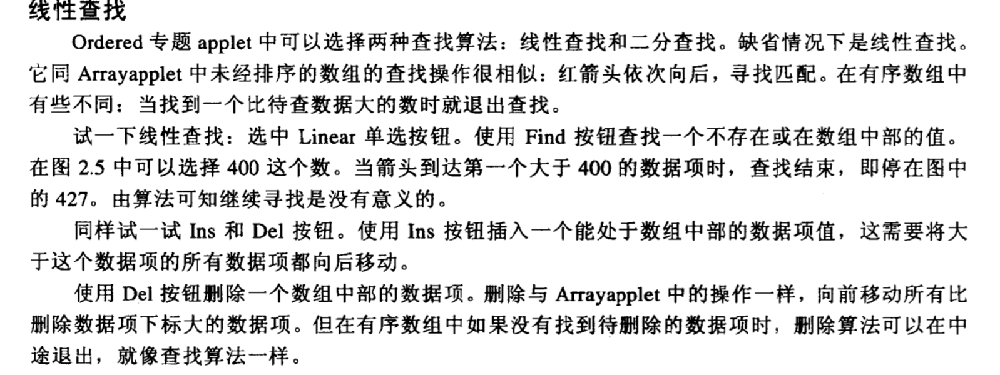

java数据结构与算法（随记）

具体内容摘录自本地书籍Java数据结构和算法 
代码git地址
综述
数据结构的概述
小结
数组
Array
Ordered专题applet
排序查找方式
有序数组的java代码
对数
存储对象
大O表示法
为什么不用数组表示一切？
小结
简单排序
如何排序
冒泡排序
选择排序
插入排序
对象排序
几种排序算法的比较
栈和队列
栈
队列
链表
链结点
单链表
双链表（双链表 != 双向链表）

综述

数据结构的概述

数组  

缺点：查找慢，删除慢，大小固定

 

1
优点：插入快，如果知道下标，可以非常快地存取
有序数组

优点：比无序数组查找快	
缺点：删除和插入慢，大小固定	

栈 

优点：提供后进先出方式的存取

 

1
缺点：存取其他项很慢
队列

优点：提供先进先出的方式的存取

 

1
缺点：存取其他项很慢
链表

优点：插入快，删除快

 

1
缺点：查找慢
二叉树

优点：查找、插入、删除都快（如果树保持平衡）

 

1
缺点：删除算法复杂
红-黑树

优点：查找、插入、删除都快。树总是平衡的

 

1
缺点：算法复杂
2-3-4树

优点：查找、插入、删除都快。树总是平衡的。类似的树对磁盘存储有用

 

1
缺点：算法复杂
哈希表

优点：如果关键字已知则存取极快。插入快

 

1
缺点：删除慢，如果不知道关键字则存取很慢，对存储空间使用不充分
堆

优点：插入、删除快，对最大数据项的存取很快

 

1
缺点：对其他数据项存取慢
图

优点：对现实世界建模

 

1
缺点：有些算法慢且复杂
 除了数组之外都可以被认为是抽象数据结构（ADT）

小结

数据结构是指数据在计算机内存空间中或磁盘中的组织形式。

正确选择数据结构会使程序的效率大大提高。

数据结构的例子有数组、栈和链表。

算法是完成特定任务的过程。

在Java中，算法经常通过类的方法实现。

本书介绍的大部分数据结构和算法经常被用来建造数据库。

一些数据结构的用途是作为程序员的工具：它们帮助执行算法。

其他数据结构可以模拟现实世界中的情况，例如城市之间的电话线网

数据库是指由许多类似的记录组成的数据存储的集合。

一条记录经常表示现实世界中的一个事物，例如一名雇员或一个汽车零件。

一条记录被分成字段。每个字段都存储量由这个记录所描述事物的一条特性。

一个关键字是一条记录中的一个字段，通过它可以对数据执行许多操作。例如，人事记录可以通过LastName字段进行排序。

数组

Array

 

1
package org.lee.algorithm;
2
​
3
import org.junit.Test;
4
​
5
/**
6
 * 数组
7
 * 

8
 * Created by liqiangpeng on 2017/11/7.
9
 */
10
public class ArrayApplet {
11
​
12
    /**
13
     * 创建数组
14
     */
15
    @Test
16
    public void testCreateArray() {
17
​
18
        int[] intArray;
19
        intArray = new int[100];
20
​
21
        /**
22
         * 等价于
23
         *
24
         *int[] intArray = new int[100];
25
         *
26
         *int intArray [] = new int[100];
27
         */
28
        System.out.println(intArray.length);//数组一但创建，数组的大小便不可变
29
    }
30
​
31
    /**
32
     * 访问数组数据项
33
     * 

34
     * 通过使用中括号中的下标数来访问
35
     */
36
    @Test
37
    public void testQueryArray() {
38
​
39
        int[] intArray;
40
        intArray = new int[100];
41
​
42
        int temp = intArray[3];//获取指定下表的元素
43
        intArray[7] = 66;//给指定下标元素插入值
44
        System.out.println(temp);
45
        System.out.println(intArray[7]);
46
    }
47
​
48
    /**
49
     * 初始化Array
50
     * 

51
     * 如果数组类型是对象，则创建好之后默认为null
52
     * 基本类型则有默认值(int默认为0)
53
     */
54
    @Test
55
    public void testInitArray() {
56
​
57
        int[] intArray = {0, 3, 6, 9, 10, 13, 24, 25, 36, 46};//大括号中的数据被称为数据列表。数组的大小由列表中的数据项的个数决定的。
58
        for (int i = 0; i <= intArray.length - 1; i++) {
59
            System.out.println(intArray[i]);
60
        }
61
    }
62
​
63
    /**
64
     * 举个栗子
65
     */
66
    @Test
67
    public void testArrayExample() {
68
​
69
        long[] arr;
70
        arr = new long[100];
71
        int nElems = 0;
72
        int j;
73
        long searchKey;
74
        //----------------------------------------------------
75
        arr[0] = 77;
76
        arr[1] = 99;
77
        arr[2] = 44;
78
        arr[3] = 55;
79
        arr[4] = 22;
80
        arr[5] = 88;
81
        arr[6] = 11;
82
        arr[7] = 00;
83
        arr[8] = 66;
84
        arr[9] = 33;
85
        nElems = 10;
86
        //----------------------------------------------------
87
        for (j = 0; j < nElems; j++)
88
            System.out.println(arr[j] + " ");
89
        //----------------------------------------------------
90
        searchKey = 66;
91
        for (j = 0; j < nElems; j++)
92
            if (arr[j] == searchKey)
93
                break;
94
        if (j == nElems)
95
            System.out.println("找不到" + searchKey);
96
        else
97
            System.out.println("找到" + searchKey);
98
        //----------------------------------------------------
99
        searchKey = 55;
100
        for (j = 0; j < nElems; j++)
101
            if (arr[j] == searchKey)
102
                break;
103
        for (int k = j; k < nElems; k++)
104
            arr[k] = arr[k + 1];
105
        nElems--;
106
        //----------------------------------------------------
107
        for (j = 0; j < nElems; j++)
108
            System.out.println(arr[j] + " ");
109
    }
110
}
111
​
Ordered专题applet

之所以排序，就说为了方便使用二分法查找数据

排序查找方式

线性查找

缺省情况是该查找方式

二分查找

二分查找能体现出有序数组的好处。相对于线性查找要快很多，尤其对于大数组来说更为显著。

有序数组的java代码

二分法查找

 

1
package org.lee.algorithm.array;
2
​
3
import org.junit.Before;
4
import org.junit.Test;
5
​
6
/**
7
 * 有序数组的java代码
8
 * 

9
 * Created by liqiangpeng on 2017/11/8.
10
 */
11
public class TwoFindArray {
12
​
13
    private long[] arr;//数组
14
    private int nElems;//数组数量
15
​
16
    /**
17
     * 初始化
18
     */
19
    @Before
20
    public void before() {
21
        arr = new long[100];
22
        //插入元素
23
        arr[0] = 1;
24
        arr[1] = 2;
25
        arr[2] = 3;
26
        arr[3] = 4;
27
        arr[4] = 5;
28
        arr[5] = 6;
29
        arr[6] = 7;
30
        arr[7] = 8;
31
        arr[8] = 9;
32
        arr[9] = 10;
33
        nElems = 10;
34
    }
35
​
36
    /**
37
     * 测试二分法查找
38
     */
39
    @Test
40
    public void testTwoFind() {
41
        int searchKey = 6;//search key
42
        int lowerBound = 0;
43
        int upperBound = nElems - 1;
44
        int curInt;
45
        while (true) {
46
            curInt = (lowerBound + upperBound) / 2;
47
            if (arr[curInt] == searchKey) {
48
                System.out.println(curInt);//找到了
49
                break;
50
            } else if (lowerBound > upperBound) {
51
                System.out.println(nElems);//找不到
52
                break;
53
            } else {
54
                if (arr[curInt] < searchKey)
55
                    lowerBound = curInt + 1;//太小。在大的那一部分
56
                else
57
                    upperBound = curInt - 1;//太大。在小的那一部分
58
            }
59
        }
60
    }
61
}
OrdArray完整类

 

1
package org.lee.algorithm.array;
2
​
3
import org.junit.Test;
4
​
5
/**
6
 * 完整数组操作
7
 * 

8
 * Created by liqiangpeng on 2017/11/8.
9
 */
10
public class OrdArray {
11
​
12
    private long[] a;
13
    private int nElems;
14
​
15
    /**
16
     * 创建空数组
17
     *
18
     * @param max 数组最大长度
19
     */
20
    public OrdArray(int max) {
21
        a = new long[max];
22
        nElems = 0;
23
    }
24
​
25
    /**
26
     * 长度
27
     *
28
     * @return 长度
29
     */
30
    public int size() {
31
        return nElems;
32
    }
33
​
34
    /**
35
     * 查找
36
     *
37
     * @param searchKey 查找key
38
     * @return 下标
39
     */
40
    public int find(long searchKey) {
41
        int lowerBound = 0;
42
        int upperBound = nElems - 1;
43
        int curInt;
44
        while (true) {
45
            curInt = (lowerBound + upperBound) / 2;
46
            if (a[curInt] == searchKey) {
47
                return curInt;
48
            } else if (lowerBound > upperBound) {
49
                return nElems;
50
            } else {
51
                if (a[curInt] < searchKey)
52
                    lowerBound = curInt + 1;//太小。在大的那一部分
53
                else
54
                    upperBound = curInt - 1;//太大。在小的那一部分
55
            }
56
        }
57
    }
58
​
59
    /**
60
     * 插入
61
     *
62
     * @param value 值
63
     */
64
    public void insert(long value) {
65
        int j;
66
        for (j = 0; j < nElems; j++)
67
            if (a[j] > value)
68
                break;
69
        for (int k = nElems; k > j; k--)
70
            a[k] = a[k - 1];
71
        a[j] = value;
72
        nElems++;
73
    }
74
​
75
    /**
76
     * 移除
77
     *
78
     * @param value 值
79
     * @return 成功与否
80
     */
81
    public boolean delete(long value) {
82
        int j = find(value);
83
        if (j == nElems)
84
            return false;
85
        else {
86
            for (int k = j; k < nElems; k++)
87
                a[k] = a[k + 1];
88
            nElems--;
89
            return true;
90
        }
91
    }
92
​
93
    /**
94
     * 遍历
95
     */
96
    public void display() {
97
        for (int j = 0; j < nElems; j++)
98
            System.out.println(a[j] + " ");
99
    }
100
​
101
​
102
​
103
}
104
​
 

1
package org.lee.algorithm.array;
2
​
3
import org.junit.Test;
4
​
5
/**
6
 * Created by liqiangpeng on 2017/11/8.
7
 */
8
public class TestOrdArray {
9
​
10
    @Test
11
    public void testFunction() {
12
        int maxSize = 100;
13
        OrdArray arr = new OrdArray(maxSize);
14
        arr.insert(2);
15
        arr.insert(1);
16
        arr.insert(3);
17
        arr.insert(5);
18
        arr.insert(4);
19
        arr.insert(6);
20
        arr.insert(7);
21
        arr.insert(8);
22
        arr.insert(9);
23
        arr.insert(10);
24
​
25
        System.out.println();
26
​
27
        int searchKey = 6;
28
        if (arr.find(searchKey) != arr.size())
29
            System.out.println("找到" + searchKey);
30
        else
31
            System.out.println("找不到" + searchKey);
32
        arr.display();
33
        System.out.println("------------------------------");
34
        arr.delete(3);
35
        arr.display();
36
    }
37
}
38
​
有序数组的优点

使用有序数组会有什么好处呢？查找速度比无序数组快多了。

 

1
不好的方面是在插入操作中由于所有靠后的数据都需要移动以腾开空间，所以速度较慢。
2
有序数组和无序数组中的删除操作都很慢，这是因为数据项必须向前移动来填补已删除数据项的洞。
3
有序数组在查找的频繁的情况下十分有用，但若是插入与删除较为频繁时，则无法高效工作。例如，有序数组适合于公司雇员的数据库。雇佣和解雇雇员同读取一个已存在雇员的有关信息或更改薪水、住址等信息相比，前两者是不经常发生的。
4
另一方面，零售商店的存活清单不适用有序数组来实现，这是由于与频繁的进货和出货相应的插入与删除操作都会执行的很慢。
二分查找所需的比较次数：

对数

方程

通过不断的将范围除以2来求出比较次数是一种算术的方法。
图 二分查找所需的比较次数 中的数字省掉了有趣的数据。这些数字不能回答某些问题，例如，在五步之内可以查找的最大范围是多少？为回答次问题首先需要建立一个类似的表：
二分查找比较次数方程图：
每次对范围加倍可以创建出一个数列，它是2的幂，与 二分查找比较次数方程图 中第三列一样。设s表示步数(乘2的次数，即2的幂)，r表示范围，则有下列方程：

​

2的指数函数的反函数

我们最初的问题同上面的相反：已知范围，求出完成搜索的步骤，即已知的是r，求s。
某叔的指数函数的反函数被称作对数。下面为我们所需要的方程：

​

这个方程说明步数（比较次数）等于以2为底数的范围的对数。什么是对数？以2为底r的对数是为了得到r重复乘以2的次数。在上表中，第一列显示的数字s便等于​ 
。

存储对象

上代码:
 

1
package org.lee.algorithm.array;
2
​
3
/**
4
 * 目标对象
5
 * 

6
 * Created by liqiangpeng on 2017/11/10.
7
 */
8
public class Person {
9
​
10
    private String lastName;
11
    private String firstName;
12
    private int age;
13
​
14
    public Person(String lastName, String firstName, int age) {
15
        this.lastName = lastName;
16
        this.firstName = firstName;
17
        this.age = age;
18
    }
19
​
20
    public String getLastName() {
21
        return lastName;
22
    }
23
​
24
    @Override
25
    public String toString() {
26
        return "Person{" +
27
                "lastName='" + lastName + '\'' +
28
                ", firstName='" + firstName + '\'' +
29
                ", age=" + age +
30
                '}';
31
    }
32
}
 

1
package org.lee.algorithm.array;
2
​
3
/**
4
 * 对象数组
5
 * 

6
 * Created by liqiangpeng on 2017/11/10.
7
 */
8
public class ClassDataArray {
9
    private Person[] a;
10
    private int nElems;
11
​
12
    /**
13
     * @param max 数组长度
14
     */
15
    public ClassDataArray(int max) {
16
        a = new Person[max];
17
        nElems = 0;
18
    }
19
​
20
    /**
21
     * @param searchName 关键字
22
     * @return 类
23
     */
24
    public Person find(String searchName) {
25
        int j;
26
        for (j = 0; j < nElems; j++)
27
            if (a[j].getLastName().equals(searchName))
28
                break;
29
        if (j == nElems)
30
            return null;
31
        else
32
            return a[j];
33
    }
34
​
35
    /**
36
     * @param lastName  lastName
37
     * @param firstName firstName
38
     * @param age       age
39
     */
40
    public void insert(String lastName, String firstName, int age) {
41
        a[nElems] = new Person(lastName, firstName, age);
42
        nElems++;
43
    }
44
​
45
    public boolean delete(String searchName) {
46
        int j;
47
        for (j = 0; j < nElems; j++)
48
            if (a[j].getLastName().equals(searchName))
49
                break;
50
        if (j == nElems)
51
            return false;
52
        else {
53
            for (int k = j; k < nElems; k++)
54
                a[k] = a[k + 1];
55
            nElems--;
56
            return true;
57
        }
58
    }
59
​
60
    public void dispalyA() {
61
        for (int j = 0; j < nElems; j++)
62
            System.out.println(a[j].toString());
63
    }
64
}
 

1
package org.lee.algorithm.array;
2
​
3
import org.junit.Before;
4
import org.junit.Test;
5
​
6
/**
7
 * 测试类
8
 * 

9
 * Created by liqiangpeng on 2017/11/10.
10
 */
11
public class TestClassDataArray {
12
​
13
    private ClassDataArray arr;
14
​
15
    @Before
16
    public void before() {
17
        int maxSize = 100;
18
​
19
        arr = new ClassDataArray(maxSize);
20
​
21
        arr.insert("qaz", "ads", 12);
22
        arr.insert("wsx", "zxc", 13);
23
        arr.insert("edc", "qwe", 14);
24
        arr.insert("rfv", "rty", 15);
25
        arr.insert("tgb", "fgh", 16);
26
        arr.insert("yhn", "vbn", 17);
27
        arr.insert("ujm", "yui", 18);
28
        arr.insert("iko", "hjk", 19);
29
        arr.insert("lpq", "nmk", 20);
30
        arr.insert("azw", "opl", 21);
31
​
32
        arr.dispalyA();
33
        System.out.println("=============before===========");
34
    }
35
​
36
    @Test
37
    public void testFind() {
38
        String searchKey = "azw";
39
        Person person = arr.find(searchKey);
40
        System.out.println(person);
41
    }
42
​
43
    @Test
44
    public void testDelete() {
45
        String searchKey1 = "wsx";
46
        String searchKey2 = "iko";
47
        boolean delete1 = arr.delete(searchKey1);
48
        boolean delete2 = arr.delete(searchKey2);
49
        System.out.println(delete1);
50
        System.out.println(delete2);
51
        arr.dispalyA();
52
    }
53
    
54
}
55
​
大O表示法

 

1
在算法的世界，常说的“算法a比算法b快两倍”这样的说法并没有多大的意义，由于当数据项个数变化时，对应的比列也会发生根本变化。我们所需一个可以描述算法的速度是如何与数据项的个数相联系的比较。
无序数组的插入：常数

无序数组的插入是到目前为止所见过的算法中唯一一个与数组项个数无关的算法。数据项总是被放在下一个有空的地方，a[nElems]，然后nElems增加。无论数组中的数据项个数N有多大，一次插入总是用相同的时间。我们可以说向一个无序数组中插入一个数据项的时间T是一个常数K：T = K

 

1
在现实情况中，插入所需的实际时间与以下因素有关：微处理器，编译程序生成程序代码的效率，等等。上面等式中K包含了所有这些因素。在现实情况中要得到K的值，需要测量一次插入所话费的时间。K就等于这个世界。
线性查找：与N成正比

在数据项的线性查找中，我们已发现寻找特定数据项所需的比较次数平均为数据项总数的一半。因此N为数据项总数，搜索时间T与N成正比： T=K*N/2

 

1
同插入一样，若要得到方程中K的值，首选需要对某个N值的查找进行计时，然后用T来计算K。当得到K后便可对任意N的值来计算T。
2
将2并入K可以得到一个更方便的公式。新K值等于原先的K除以2。新公式为：T=K*N
3
这个方程说明平均线性查找时间与数组的大小成正比。即如果一个数组增大两倍，则所话费的时间也会相应地增长两倍。
二分查找：与log(N)成正比
​	
同样，二分查找制定的一个与T和N有关的公式：

​
​		

 

1
正如前面所提到的，时间T与以2为底N的对数成正比。实际上，由于所有的对数和其他对数成正比（从底数为2转换到底数为10需乘以3.322），我们可以将这个为常数的底数也并入K。由此可不必指定底数
​

不要用常数

大O表示法同上面公式类似，但它省去了常数K。当比较算法时，并不在具体的微处理器芯片或者编译器；真正需要比较的是对应不同的N值，T是如何变化的，而不是具体的数字。因此不需要常数。

 

1
大O表示法使用大写字母O，可以认为其含义是“order of”（大约是）。我们可以用大O表示法来描述线性查找使用了O(N)级时间，二分查找使用了O(log N)即时间。向一个无序数组中的插入使用了O(1),或者常数级时间。
常用算法的运行时间:

大O的时间图：

为什么不用数组表示一切？

 

1
    我们已经见到了许多关于数组的缺点。在一个无序数组中可以很快进行插入（O(1)时间），但是查找却要花费较慢的O(N)时间。在一个有序数组中可以查找的很快，用O(LogN)的时间，但插入却花费了O(N)的时间。对于这种数组而言，由于平均半数的数据项为了填补“空洞”必须移动，所以删除操作平均需要O(N)时间。
2
    如果有一种数据结构进行如何插入、删除和查找的操作都很快(理想的O(1)或者是O(LogN)时间)，那就好了。
3
    数组的另一个问题便是它们被new创建以后，大小就被固定住了。但通常在开始设计程序时并不知道会有多少数据将被放入数组中，所以需要猜它大小。如果猜的数过大，会使数组中的某些单元永远不会被填充而浪费空间。如果猜的过小，会发生数组益处，最好的情况下会向程序的用户发出警告信息，最坏的情况则会导致程序奔溃。
4
    java中有一个被称作向量(vector)类，使用起来很像数组，但是它可以扩展。这些附加功能是以效率作为代价的。当类用户使用类中的内部数组将要溢出时，插入算法创建一个大一点的数组，把旧数组中的内容复制到新数组中，然后插入新数据项。整个过程对于用户来说是不可见的。
小结

java中数组是对象，由new操作符创建。

无序数组可以提供快速的插入，但查找和删除较慢

将数组封装到类中可以保护数组不被随意更改。

类的接口由类用户可访问的方法（有时还有字段）组成。

类的接口被设计成使类用户的操作更加简单。

有序数组可以使用二分查找。

以B为底A的对数（大概）是在小于1之前用B除A的次数。

线性查找需要的时间与数组中数据项的个数成正比。

二分查找需要的时间与数组中数据项的个数的对数成正比。

大O表示法为比较算法的速度提供一种方便的方法。

O(1)级时间的算法是最好的，O(logN)次之，O(N)为一般，O(N^2)最差。

简单排序

如何排序

 

1
计算机程序无法像人一样通览所有数据。它只能根据计算机的“比较”操作原理，在同一时间内对两条数据进行比对。
2
算法的这种“管视“将是一个反复出现的问题。
3
本章中的三个算法都包括如下两个步骤，这两步循环执行，直到全部数据有序为止：
4
    1.比较两个数据项。
5
    2.交换两个数据项，或复制其中一项。  
6
    但是每种算法具体实现的细节有所不同。  
冒泡排序

 

1
冒泡排序算法运行起来非常慢，但在概念上它是排序算法中最简单的。
冒泡排序java代码

数组类：ArrayBub.java
 

1
package org.lee.algorithm.sort.maopao;
2
​
3
/**
4
 * 对象化
5
 * 

6
 * Created by liqiangpeng on 2018/1/4.
7
 */
8
public class ArrayBub {
9
    private long[] a;
10
    private int nElems;
11
​
12
    /**
13
     * 构造方法初始化
14
     *
15
     * @param max 数组最大长度
16
     */
17
    public ArrayBub(int max) {
18
        a = new long[max];
19
        nElems = 0;
20
    }
21
​
22
    /**
23
     * 给数组中添加值
24
     *
25
     * @param value
26
     */
27
    public void insert(long value) {
28
        a[nElems] = value;//将值插入到当前数组长度中
29
        nElems++;//长度+1
30
    }
31
​
32
    /**
33
     * 打印
34
     */
35
    public void dispaly() {
36
        for (int j = 0; j < nElems; j++)
37
            System.out.print(a[j] + " ");
38
        System.out.println("");
39
    }
40
​
41
    /**
42
     * 排序
43
     */
44
    public void bubbleSort() {
45
        int out, in;
46
        for (out = nElems - 1; out > 1; out--)
47
            for (in = 0; in < out; in++) {
48
                if (a[in] > a[in + 1])
49
                    swap(in, in + 1);
50
                //将以下注释打开可查看每次比对情况
51
                /*System.out.print("out===== " + out);
52
                System.out.print("     in===== " + in);
53
                System.out.println("   开始比较第" + in + "和第" + (in + 1) + "下标的值");
54
                dispaly();*/
55
            }
56
    }
57
​
58
    /**
59
     * 交换位置 [将交换独立出来不一定好，因为方法会增加额外的消耗，出入棧？]
60
     *
61
     * @param one val1
62
     * @param two val2
63
     */
64
    private void swap(int one, int two) {
65
        long temp = a[one];
66
        a[one] = a[two];
67
        a[two] = temp;
68
    }
69
​
70
    /**
71
     * 数组长度
72
     *
73
     * @return 数组长度
74
     */
75
    public int size() {
76
        return nElems;
77
    }
78
}
测试类：BubbleSortApp.java
 

1
package org.lee.algorithm.sort.maopao;
2
​
3
/**
4
 * 测试类
5
 * 

6
 * Created by liqiangpeng on 2018/1/4.
7
 */
8
public class BubbleSortApp {
9
    public static void main(String[] args) {
10
        int maxSize = 100;
11
        ArrayBub arr;
12
        arr = new ArrayBub(maxSize);
13
        arr.insert(7);
14
        arr.insert(9);
15
        arr.insert(4);
16
        arr.insert(5);
17
        arr.insert(2);
18
        arr.insert(8);
19
        arr.insert(1);
20
        arr.insert(0);
21
        arr.insert(6);
22
        arr.insert(3);
23
        System.out.println("数组长度为：" + arr.size());
24
        arr.dispaly();
25
        arr.bubbleSort();
26
        arr.dispaly();
27
    }
28
}
运行结果：
 

1
数组长度为：10
2
排序前：7 9 4 5 2 8 1 0 6 3 
3
out===== 9     in===== 0   开始比较第0和第1下标的值
4
7 9 4 5 2 8 1 0 6 3 
5
out===== 9     in===== 1   开始比较第1和第2下标的值
6
7 4 9 5 2 8 1 0 6 3 
7
out===== 9     in===== 2   开始比较第2和第3下标的值
8
7 4 5 9 2 8 1 0 6 3 
9
out===== 9     in===== 3   开始比较第3和第4下标的值
10
7 4 5 2 9 8 1 0 6 3 
11
out===== 9     in===== 4   开始比较第4和第5下标的值
12
7 4 5 2 8 9 1 0 6 3 
13
out===== 9     in===== 5   开始比较第5和第6下标的值
14
7 4 5 2 8 1 9 0 6 3 
15
out===== 9     in===== 6   开始比较第6和第7下标的值
16
7 4 5 2 8 1 0 9 6 3 
17
out===== 9     in===== 7   开始比较第7和第8下标的值
18
7 4 5 2 8 1 0 6 9 3 
19
out===== 9     in===== 8   开始比较第8和第9下标的值
20
7 4 5 2 8 1 0 6 3 9 
21
out===== 8     in===== 0   开始比较第0和第1下标的值
22
4 7 5 2 8 1 0 6 3 9 
23
out===== 8     in===== 1   开始比较第1和第2下标的值
24
4 5 7 2 8 1 0 6 3 9 
25
out===== 8     in===== 2   开始比较第2和第3下标的值
26
4 5 2 7 8 1 0 6 3 9 
27
out===== 8     in===== 3   开始比较第3和第4下标的值
28
4 5 2 7 8 1 0 6 3 9 
29
out===== 8     in===== 4   开始比较第4和第5下标的值
30
4 5 2 7 1 8 0 6 3 9 
31
out===== 8     in===== 5   开始比较第5和第6下标的值
32
4 5 2 7 1 0 8 6 3 9 
33
out===== 8     in===== 6   开始比较第6和第7下标的值
34
4 5 2 7 1 0 6 8 3 9 
35
out===== 8     in===== 7   开始比较第7和第8下标的值
36
4 5 2 7 1 0 6 3 8 9 
37
out===== 7     in===== 0   开始比较第0和第1下标的值
38
4 5 2 7 1 0 6 3 8 9 
39
out===== 7     in===== 1   开始比较第1和第2下标的值
40
4 2 5 7 1 0 6 3 8 9 
41
out===== 7     in===== 2   开始比较第2和第3下标的值
42
4 2 5 7 1 0 6 3 8 9 
43
out===== 7     in===== 3   开始比较第3和第4下标的值
44
4 2 5 1 7 0 6 3 8 9 
45
out===== 7     in===== 4   开始比较第4和第5下标的值
46
4 2 5 1 0 7 6 3 8 9 
47
out===== 7     in===== 5   开始比较第5和第6下标的值
48
4 2 5 1 0 6 7 3 8 9 
49
out===== 7     in===== 6   开始比较第6和第7下标的值
50
4 2 5 1 0 6 3 7 8 9 
51
out===== 6     in===== 0   开始比较第0和第1下标的值
52
2 4 5 1 0 6 3 7 8 9 
53
out===== 6     in===== 1   开始比较第1和第2下标的值
54
2 4 5 1 0 6 3 7 8 9 
55
out===== 6     in===== 2   开始比较第2和第3下标的值
56
2 4 1 5 0 6 3 7 8 9 
57
out===== 6     in===== 3   开始比较第3和第4下标的值
58
2 4 1 0 5 6 3 7 8 9 
59
out===== 6     in===== 4   开始比较第4和第5下标的值
60
2 4 1 0 5 6 3 7 8 9 
61
out===== 6     in===== 5   开始比较第5和第6下标的值
62
2 4 1 0 5 3 6 7 8 9 
63
out===== 5     in===== 0   开始比较第0和第1下标的值
64
2 4 1 0 5 3 6 7 8 9 
65
out===== 5     in===== 1   开始比较第1和第2下标的值
66
2 1 4 0 5 3 6 7 8 9 
67
out===== 5     in===== 2   开始比较第2和第3下标的值
68
2 1 0 4 5 3 6 7 8 9 
69
out===== 5     in===== 3   开始比较第3和第4下标的值
70
2 1 0 4 5 3 6 7 8 9 
71
out===== 5     in===== 4   开始比较第4和第5下标的值
72
2 1 0 4 3 5 6 7 8 9 
73
out===== 4     in===== 0   开始比较第0和第1下标的值
74
1 2 0 4 3 5 6 7 8 9 
75
out===== 4     in===== 1   开始比较第1和第2下标的值
76
1 0 2 4 3 5 6 7 8 9 
77
out===== 4     in===== 2   开始比较第2和第3下标的值
78
1 0 2 4 3 5 6 7 8 9 
79
out===== 4     in===== 3   开始比较第3和第4下标的值
80
1 0 2 3 4 5 6 7 8 9 
81
out===== 3     in===== 0   开始比较第0和第1下标的值
82
0 1 2 3 4 5 6 7 8 9 
83
out===== 3     in===== 1   开始比较第1和第2下标的值
84
0 1 2 3 4 5 6 7 8 9 
85
out===== 3     in===== 2   开始比较第2和第3下标的值
86
0 1 2 3 4 5 6 7 8 9 
87
out===== 2     in===== 0   开始比较第0和第1下标的值
88
0 1 2 3 4 5 6 7 8 9 
89
out===== 2     in===== 1   开始比较第1和第2下标的值
90
0 1 2 3 4 5 6 7 8 9 
91
排序后：0 1 2 3 4 5 6 7 8 9 
不变性

在许多算法中，有些条件在算法执行时是不变的。这些条件被称为不变性。

 

1
在bubbleSort.java中，不变性是指out右边的所有数据项为有序（在循环过程中，每次外围for循环结束一次即out--，out所在下标的右边都是有序的；也就是说排序是把最大的放到最后，再把第二大的放到倒数第二，以此类推）。在算法的整个运行过程这个条件始终为真。
冒泡排序的效率

第一趟排序进行了9次比较，第二趟进行了8次，如此类推，直到最后一趟进行了一次比较。

对于十个数据项，就是9+8+7+6+5+4+3+2+1=45
一般来说，数组中有N个数据项，则第一趟排序中有N-1次比较，第二趟中有N-2次，如此类推。这种序列的求和公式：(N-1)+(N-2)+(N-3)+...+1=N*(N-1)/2
当N为10时，10*9/2=45
这样，算法约做了N^2/2次比较（忽略减1，不会有很大差别，特别是N很大的时候）
因为有判断【前一个数据大于后一个数据】时才交换，所以交换的次数少于比较的次数。如果数据是随机的，那么大概有一半的数据需要交换，则交换的次数为N^2/4。（在最坏的情况下，即数据逆序时，每次比较都需要交换）。
选择排序

冒泡排序，有序的数据都从右边开始，而选择排序从左边开始。
详细描述

从最左边开始。先记录最左端的数据，并记录下标（一般存储在内存）。于是开始用下一条数据和记录的数据进行比较。如果这条数据更小，则将记录改为这条数据下标。继续走下去，每条数据都和记录中的数据进行比较，发现有更小的数据时，更新记录。

当做完这些事时，记录中就会是最小的数据，将这条数据与最左边的数据进行交换。
现在，已经对第一条数据排好序了，期间做了N-1次比较，但是只进行了一次交换。
在接下来的排序中，所做的事情是一摸一样的，只是需要忽略最左边的数据，因为它已经排好序了。因此算法的第二趟排序从1位置开始。每排完一次序，就多一个有序数据，并被安排在左边，下次在找新的最小值时就可以少考虑一条数据。
选择排序的java代码

数组类：ArraySel.java
 

1
package org.lee.algorithm.sort.xuanze;
2
​
3
/**
4
 * Created by liqiangpeng on 2018/1/4.
5
 */
6
public class ArraySel {
7
    private long[] a;
8
    private int nElems;
9
​
10
    /**
11
     * 构造方法初始化
12
     *
13
     * @param max 数组最大长度
14
     */
15
    public ArraySel(int max) {
16
        a = new long[max];
17
        nElems = 0;
18
    }
19
​
20
    /**
21
     * 给数组中添加值
22
     *
23
     * @param value
24
     */
25
    public void insert(long value) {
26
        a[nElems] = value;//将值插入到当前数组长度中
27
        nElems++;//长度+1
28
    }
29
​
30
    /**
31
     * 打印
32
     */
33
    public void dispaly() {
34
        for (int j = 0; j < nElems; j++)
35
            System.out.print(a[j] + " ");
36
        System.out.println("");
37
    }
38
​
39
    /**
40
     * 排序
41
     */
42
    public void selectionSort() {
43
        int out, in, min;
44
        for (out = 0; out < nElems - 1; out++) {
45
            min = out;//当每次循环结束时，已经确定了out所在右边已经排好序，记录最小数，下次循环从out+1开始，忽略前面已排好序的数据
46
            for (in = out + 1; in < nElems; in++)//从out右边开始
47
                if (a[in] < a[min])
48
                    min = in;//只要发现最小的数据，记录下来
49
            swap(out, min);//跟out交换
50
            //将以下注释打开可查看详细交换信息
51
            /*System.out.print("out=====" + out);
52
            System.out.print("  in======" + in);
53
            System.out.println("  min======" + min);
54
            dispaly();*/
55
        }
56
    }
57
​
58
    /**
59
     * 交换位置 [将交换独立出来不一定好，因为方法会增加额外的消耗，出入棧？]
60
     *
61
     * @param one val1
62
     * @param two val2
63
     */
64
    private void swap(int one, int two) {
65
        long temp = a[one];
66
        a[one] = a[two];
67
        a[two] = temp;
68
    }
69
​
70
    /**
71
     * 数组长度
72
     *
73
     * @return 数组长度
74
     */
75
    public int size() {
76
        return nElems;
77
    }
78
}
79
​
测试类:SelectSortApp.java
 

1
package org.lee.algorithm.sort.xuanze;
2
​
3
/**
4
 * 测试类
5
 * 

6
 * Created by liqiangpeng on 2018/1/4.
7
 */
8
public class SelectSortApp {
9
    public static void main(String[] args) {
10
        int maxSize = 100;
11
        ArraySel arr = new ArraySel(maxSize);
12
        arr.insert(77);
13
        arr.insert(99);
14
        arr.insert(44);
15
        arr.insert(55);
16
        arr.insert(22);
17
        arr.insert(88);
18
        arr.insert(11);
19
        arr.insert(00);
20
        arr.insert(66);
21
        arr.insert(33);
22
        System.out.println("数组长度为：" + arr.size());
23
        System.out.print("排序前：");
24
        arr.dispaly();
25
        arr.selectionSort();
26
        System.out.print("排序后：");
27
        arr.dispaly();
28
    }
29
}
执行结果:
数组长度为：10
排序前：77 99 44 55 22 88 11 0 66 33 
out=====0  in======10  min======7
0 99 44 55 22 88 11 77 66 33 
out=====1  in======10  min======6
0 11 44 55 22 88 99 77 66 33 
out=====2  in======10  min======4
0 11 22 55 44 88 99 77 66 33 
out=====3  in======10  min======9
0 11 22 33 44 88 99 77 66 55 
out=====4  in======10  min======4
0 11 22 33 44 88 99 77 66 55 
out=====5  in======10  min======9
0 11 22 33 44 55 99 77 66 88 
out=====6  in======10  min======8
0 11 22 33 44 55 66 77 99 88 
out=====7  in======10  min======7
0 11 22 33 44 55 66 77 99 88 
out=====8  in======10  min======9
0 11 22 33 44 55 66 77 88 99 
排序后：0 11 22 33 44 55 66 77 88 99
不变性
​	
在selectSort.java程序中，小标小于out的位置的数据总是有序的。

选择排序的效率

选择排序和冒泡排序执行了相同次数的比较：N*(N-1)/2。对于10个数据项，需要45次比较。

然而，10个数据项只需要少于10次交换。对于100个数据项，需要4950次比较，但只进行了不到100次的交换。N值很大时，比较的次数是主要的。
插入排序

插入排序java代码

数组类：InsertSort.java
 

1
package org.lee.algorithm.sort.charu;
2
​
3
/**
4
 * Created by liqiangpeng on 2018/1/4.
5
 */
6
public class InsertSort {
7
    private long[] a;
8
    private int nElems;
9
​
10
    /**
11
     * 构造方法初始化
12
     *
13
     * @param max 数组最大长度
14
     */
15
    public InsertSort(int max) {
16
        a = new long[max];
17
        nElems = 0;
18
    }
19
​
20
    /**
21
     * 给数组中添加值
22
     *
23
     * @param value
24
     */
25
    public void insert(long value) {
26
        a[nElems] = value;//将值插入到当前数组长度中
27
        nElems++;//长度+1
28
    }
29
​
30
    /**
31
     * 打印
32
     */
33
    public void dispaly() {
34
        for (int j = 0; j < nElems; j++)
35
            System.out.print(a[j] + " ");
36
        System.out.println("");
37
    }
38
​
39
    /**
40
     * 排序
41
     */
42
    public void insertionSort() {
43
        int in, out;
44
        for (out = 1; out < nElems; out++) {
45
            long temp = a[out];
46
            in = out;
47
            while (in > 0 && a[in - 1] > temp) {
48
                a[in] = a[in - 1];
49
                --in;
50
                //将以下注释打开查看详细交换情况
51
                /*System.out.print("out=====" + out);
52
                System.out.print("    temp====" + temp);
53
                System.out.println("    in=====" + in);
54
                dispaly();*/
55
            }
56
            a[in] = temp;
57
            /*System.out.print("第" + out + "次外循环交换后： ");
58
            dispaly();*/
59
        }
60
    }
61
​
62
    /**
63
     * 数组长度
64
     *
65
     * @return 数组长度
66
     */
67
    public int size() {
68
        return nElems;
69
    }
70
}
测试类：InsertSortApp.java
 

1
package org.lee.algorithm.sort.charu;
2
​
3
​
4
/**
5
 * 测试类
6
 * 

7
 * Created by liqiangpeng on 2018/1/4.
8
 */
9
public class InsertSortApp {
10
    public static void main(String[] args) {
11
        int maxSize = 100;
12
        InsertSort arr = new InsertSort(maxSize);
13
        arr.insert(77);
14
        arr.insert(99);
15
        arr.insert(44);
16
        arr.insert(55);
17
        arr.insert(22);
18
        arr.insert(88);
19
        arr.insert(11);
20
        arr.insert(00);
21
        arr.insert(66);
22
        arr.insert(33);
23
        System.out.println("数组长度为：" + arr.size());
24
        System.out.print("排序前：");
25
        arr.dispaly();
26
        arr.insertionSort();
27
        System.out.print("排序后：");
28
        arr.dispaly();
29
    }
30
}
运行结果：
数组长度为：10
排序前：77 99 44 55 22 88 11 0 66 33 
第1次外循环交换后： 77 99 44 55 22 88 11 0 66 33 
out=====2    temp====44    in=====1
77 99 99 55 22 88 11 0 66 33 
out=====2    temp====44    in=====0
77 77 99 55 22 88 11 0 66 33 
第2次外循环交换后： 44 77 99 55 22 88 11 0 66 33 
out=====3    temp====55    in=====2
44 77 99 99 22 88 11 0 66 33 
out=====3    temp====55    in=====1
44 77 77 99 22 88 11 0 66 33 
第3次外循环交换后： 44 55 77 99 22 88 11 0 66 33 
out=====4    temp====22    in=====3
44 55 77 99 99 88 11 0 66 33 
out=====4    temp====22    in=====2
44 55 77 77 99 88 11 0 66 33 
out=====4    temp====22    in=====1
44 55 55 77 99 88 11 0 66 33 
out=====4    temp====22    in=====0
44 44 55 77 99 88 11 0 66 33 
第4次外循环交换后： 22 44 55 77 99 88 11 0 66 33 
out=====5    temp====88    in=====4
22 44 55 77 99 99 11 0 66 33 
第5次外循环交换后： 22 44 55 77 88 99 11 0 66 33 
out=====6    temp====11    in=====5
22 44 55 77 88 99 99 0 66 33 
out=====6    temp====11    in=====4
22 44 55 77 88 88 99 0 66 33 
out=====6    temp====11    in=====3
22 44 55 77 77 88 99 0 66 33 
out=====6    temp====11    in=====2
22 44 55 55 77 88 99 0 66 33 
out=====6    temp====11    in=====1
22 44 44 55 77 88 99 0 66 33 
out=====6    temp====11    in=====0
22 22 44 55 77 88 99 0 66 33 
第6次外循环交换后： 11 22 44 55 77 88 99 0 66 33 
out=====7    temp====0    in=====6
11 22 44 55 77 88 99 99 66 33 
out=====7    temp====0    in=====5
11 22 44 55 77 88 88 99 66 33 
out=====7    temp====0    in=====4
11 22 44 55 77 77 88 99 66 33 
out=====7    temp====0    in=====3
11 22 44 55 55 77 88 99 66 33 
out=====7    temp====0    in=====2
11 22 44 44 55 77 88 99 66 33 
out=====7    temp====0    in=====1
11 22 22 44 55 77 88 99 66 33 
out=====7    temp====0    in=====0
11 11 22 44 55 77 88 99 66 33 
第7次外循环交换后： 0 11 22 44 55 77 88 99 66 33 
out=====8    temp====66    in=====7
0 11 22 44 55 77 88 99 99 33 
out=====8    temp====66    in=====6
0 11 22 44 55 77 88 88 99 33 
out=====8    temp====66    in=====5
0 11 22 44 55 77 77 88 99 33 
第8次外循环交换后： 0 11 22 44 55 66 77 88 99 33 
out=====9    temp====33    in=====8
0 11 22 44 55 66 77 88 99 99 
out=====9    temp====33    in=====7
0 11 22 44 55 66 77 88 88 99 
out=====9    temp====33    in=====6
0 11 22 44 55 66 77 77 88 99 
out=====9    temp====33    in=====5
0 11 22 44 55 66 66 77 88 99 
out=====9    temp====33    in=====4
0 11 22 44 55 55 66 77 88 99 
out=====9    temp====33    in=====3
0 11 22 44 44 55 66 77 88 99 
第9次外循环交换后： 0 11 22 33 44 55 66 77 88 99 
排序后：0 11 22 33 44 55 66 77 88 99 
插入排序中的不变性

在每趟结束后，在将temp位置的项插入后，比out变量下标号小的数据项都是局部有序的。

插入排序的效率

在第一趟排序中，它最多比较一次，第二趟最多比较两次，以此类推。最后一趟最多，比较N-1次。

因此有：1+2+3+...+N-1=N*(N-1)/2
然而，因为在每一趟排序发现插入点之前。平均只有全体数据项的一半真的进行了比较所以得到
N*(N-1)/4
对象排序

为简单起见，前面应用排序算法时都是使用的基本数据类型。但是在实际应用中更多的使用的是对象类型。
对象排序的java代码

对象类：Person.java
 

1
package org.lee.algorithm.sort.object;
2
​
3
/**
4
 * Created by liqiangpeng on 2018/1/4.
5
 */
6
public class Person {
7
    private String lastName;
8
    private String firstName;
9
    private int age;
10
​
11
    public Person(String lastName, String firstName, int age) {
12
        this.lastName = lastName;
13
        this.firstName = firstName;
14
        this.age = age;
15
    }
16
​
17
    public String getLastName() {
18
        return lastName;
19
    }
20
​
21
    @Override
22
    public String toString() {
23
        return "Person{" +
24
                "lastName='" + lastName + '\'' +
25
                ", firstName='" + firstName + '\'' +
26
                ", age=" + age +
27
                '}';
28
    }
29
}
数组对象类：ArrayInOb.java
 

1
package org.lee.algorithm.sort.object;
2
​
3
/**
4
 * Created by liqiangpeng on 2018/1/4.
5
 */
6
public class ArrayInOb {
7
    private Person[] a;
8
    private int nElems;
9
​
10
    public ArrayInOb(int max) {
11
        a = new Person[max];
12
        nElems = 0;
13
    }
14
​
15
    public void insert(String last, String first, int age) {
16
        a[nElems] = new Person(last, first, age);
17
        nElems++;
18
    }
19
​
20
    public void dispaly() {
21
        for (int j = 0; j < nElems; j++) {
22
            System.out.println(a[j]);
23
        }
24
    }
25
​
26
    /**
27
     * 根据lastName排序
28
     */
29
    public void insertionSort() {
30
        int in, out;
31
        for (out = 1; out < nElems; out++) {
32
            Person temp = a[out];
33
            in = out;
34
            while (in > 0 && a[in - 1].getLastName().compareTo(temp.getLastName()) > 0) {
35
                a[in] = a[in - 1];
36
                --in;
37
            }
38
            a[in] = temp;
39
        }
40
    }
41
}
测试类：ObjectSortApp.java
 

1
package org.lee.algorithm.sort.object;
2
​
3
/**
4
 * Created by liqiangpeng on 2018/1/4.
5
 */
6
public class ObjectSortApp {
7
    public static void main(String[] args) {
8
        int maxSize = 100;
9
        ArrayInOb arr = new ArrayInOb(maxSize);
10
​
11
        arr.insert("Evans","Patty",24);
12
        arr.insert("Smith","Doc",59);
13
        arr.insert("Smith","Lorraine",37);
14
        arr.insert("Smith","Paul",37);
15
        arr.insert("Yee","Tom",43);
16
        arr.insert("Hashimoto","Sato",21);
17
        arr.insert("Stimson","Henry",29);
18
        arr.insert("Velasquez","Jose",72);
19
        arr.insert("Vang","Minh",22);
20
        arr.insert("Creswell","Luvinda",18);
21
​
22
        System.out.println("排序前：");
23
        arr.dispaly();
24
        arr.insertionSort();
25
        System.out.println("排序后：");
26
        arr.dispaly();
27
​
28
    }
29
}
运行结果：
排序前：
Person{lastName='Evans', firstName='Patty', age=24}
Person{lastName='Smith', firstName='Doc', age=59}
Person{lastName='Smith', firstName='Lorraine', age=37}
Person{lastName='Smith', firstName='Paul', age=37}
Person{lastName='Yee', firstName='Tom', age=43}
Person{lastName='Hashimoto', firstName='Sato', age=21}
Person{lastName='Stimson', firstName='Henry', age=29}
Person{lastName='Velasquez', firstName='Jose', age=72}
Person{lastName='Vang', firstName='Minh', age=22}
Person{lastName='Creswell', firstName='Luvinda', age=18}
排序后：
Person{lastName='Creswell', firstName='Luvinda', age=18}
Person{lastName='Evans', firstName='Patty', age=24}
Person{lastName='Hashimoto', firstName='Sato', age=21}
Person{lastName='Smith', firstName='Doc', age=59}
Person{lastName='Smith', firstName='Lorraine', age=37}
Person{lastName='Smith', firstName='Paul', age=37}
Person{lastName='Stimson', firstName='Henry', age=29}
Person{lastName='Vang', firstName='Minh', age=22}
Person{lastName='Velasquez', firstName='Jose', age=72}
Person{lastName='Yee', firstName='Tom', age=43}
单词排序

ArrayInOb.java程序中的insertSort()和InsertSort.java中的insertionSort()类似。只是比较的不再是基本数据类型，而是对象类型中的lastName属性。

  表达式:a[in - 1].getLastName().compareTo(temp.getLastName())
compareTo()方法根据两个String的字典顺序返回给调用者不同的整数值，这两个String一个是方法的调用者，一个是这个方法的参数，如下表格：		
s2.compareTo(s1)	返回值
s1>s2	小于0
s1=s2	等于0
s1>s2	大于0
稳定性

有些时候要考虑数据项拥有相同关键字的情况。例如，雇员数据按雇员的姓的字典序排序，先走又想按邮政编码排序，并希望具有相同邮政编码的数据仍然按照姓排序。这种情况下，则只需要算法对需要排序的数据进行排序，让不需要排序的数据保持原来的顺序。某些算法满足这样的要求，它们就可以称为稳定的算法。

本章中所有的算法都是稳定的。例如，ObjectSortApp.java中的输出，有三个人的姓都是Smith。开始顺序为Doc Smith、Lorraine Smith和Paul Smith。排序后，这个顺序依然存在。	
几种排序算法的比较

一般情况几乎不太使用冒泡排序算法，过于简单。然而数据量小的时候它会有些应用价值。
选择排序虽然把交换次数降到最低，但比较的次数仍然很大。当数据量很小，并且交换数据相对于比较数据更加耗时的情况下，可以应用选择排序。
大多数情况下，假设数据量比较小或基本有序时，插入排序算法是三种简单排序中最好的选择。
栈和队列

栈

 

1
栈只允许访问一个数据项：即最后插入的数据项，移除(出栈)该数据项才能访问第二个数据项。
数组模拟栈

StackX.java
 

1
package org.lee.algorithm.stackAndQueue.stack;
2
​
3
import java.io.BufferedReader;
4
import java.io.IOException;
5
import java.io.InputStreamReader;
6
​
7
/**
8
 * 栈
9
 */
10
public class StackX {
11
    private int maxSize;
12
    private char[] stackArray;
13
    private int top;
14
​
15
    /**
16
     * 初始化
17
     *
18
     * @param s 长度
19
     */
20
    public StackX(int s) {
21
        maxSize = s;
22
        stackArray = new char[maxSize];
23
        top = -1;
24
    }
25
​
26
    /**
27
     * 压栈
28
     *
29
     * @param j
30
     */
31
    public void push(char j) {
32
        stackArray[++top] = j;
33
    }
34
​
35
    /**
36
     * 出栈
37
     *
38
     * @return
39
     */
40
    public char pop() {
41
        return stackArray[top--];
42
    }
43
​
44
    /**
45
     * 查看
46
     *
47
     * @return
48
     */
49
    public char peek() {
50
        return stackArray[top];
51
    }
52
​
53
    /**
54
     * 非空判断
55
     *
56
     * @return
57
     */
58
    public boolean isEmpty() {
59
        return (top == -1);
60
    }
61
​
62
    /**
63
     * 数组是否满
64
     *
65
     * @return
66
     */
67
    public boolean isFull() {
68
        return (top == maxSize - 1);
69
    }
70
}
71
​
72
/**
73
 * 测试栈
74
 */
75
class StackApp {
76
    public static void main(String[] args) {
77
        StackX stackX = new StackX(10);
78
        stackX.push('l');
79
        stackX.push('e');
80
        stackX.push('e');
81
        stackX.push('s');
82
​
83
        while (!stackX.isEmpty()) {
84
            System.out.println("查看到 " + stackX.peek());
85
            char value = stackX.pop();
86
            System.out.println(value + " 已出栈");
87
            System.out.println("==========");
88
​
89
        }
90
    }
91
}
92
​
93
/**
94
 * 输入工具
95
 */
96
class InputUtils {
97
    public static String getString() throws IOException {
98
        BufferedReader br = new BufferedReader(new InputStreamReader(System.in));
99
        return br.readLine();
100
    }
101
}
运行结果
查看到 s
s 已出栈
==========
查看到 e
e 已出栈
==========
查看到 e
e 已出栈
==========
查看到 l
l 已出栈
==========
单词逆序

Reverser.java
 

1
package org.lee.algorithm.stackAndQueue.stack;
2
​
3
import java.io.IOException;
4
​
5
/**
6
 * 单词反转
7
 * 

8
 * Created by liqiangpeng on 2018/1/18.
9
 */
10
public class Reverser {
11
​
12
    private String input;
13
    private String output;
14
​
15
    public Reverser(String in) {
16
        input = in;
17
    }
18
​
19
    public String doRev() {
20
        int stackSize = input.length();
21
        StackX theStack = new StackX(stackSize);
22
        for (int j = 0; j < input.length(); j++) {
23
            char ch = input.charAt(j);
24
            theStack.push(ch);
25
        }
26
        output = "";
27
        while (!theStack.isEmpty()) {
28
            char ch = theStack.pop();
29
            output = output + ch;
30
        }
31
        return output;
32
    }
33
}
34
​
35
/**
36
 * 测试单词反转
37
 */
38
class ReverseApp {
39
​
40
    public static void main(String[] args) throws IOException {
41
        String input, output;
42
        while (true) {
43
            System.out.println("输入字符串：");
44
            System.out.flush();
45
            input = InputUtils.getString();
46
            if (input.equals(""))
47
                break;
48
            Reverser theReverser = new Reverser(input);
49
            output = theReverser.doRev();
50
            System.out.println("字符串反转后：" + output);
51
​
52
        }
53
    }
54
​
55
​
56
}
运行结果
输入字符串：
fasdjgasfasjiewruo
字符串反转后：ourweijsafsagjdsaf
输入字符串：
分隔符匹配

例如编译一段代码（不一定是java代码），它同样需要java程序一样的分隔符，分隔符包括大括号"{"和"}"，中括号"["和"]"，小括号"("和")"。每个左分隔符都需要和右分隔符匹配。
分隔符匹配程序从输入的字符串中不断读取，碰到左分隔符就压入栈，碰到右分隔符从栈顶弹出与右分隔符匹配。
BracketChecker.java
 

1
package org.lee.algorithm.stackAndQueue.stack;
2
​
3
import java.io.IOException;
4
​
5
/**
6
 * 栈模拟编译器中的分隔符匹配
7
 * 

8
 * Created by liqiangpeng on 2018/1/18.
9
 */
10
public class BracketChecker {
11
    private String input;
12
​
13
    public BracketChecker(String in) {
14
        input = in;
15
    }
16
​
17
    public void check() {
18
        int stackSize = input.length();
19
        StackX theStack = new StackX(stackSize);
20
​
21
        for (int j = 0; j < input.length(); j++) {
22
            char ch = input.charAt(j);
23
            switch (ch) {
24
                case '{':
25
                case '[':
26
                case '(':
27
                    theStack.push(ch);//将作分割符的数据压栈
28
                    break;
29
                case '}':
30
                case ']':
31
                case ')':
32
                    if (!theStack.isEmpty()) {//说明栈中已有左分隔符的数据，弹出栈顶的数据，与右分隔符比较
33
                        char chx = theStack.pop();
34
                        if ((ch == '}' && chx != '{') ||
35
                                (ch == ']' && chx != '[') ||
36
                                (ch == ')' && chx != '('))
37
                            System.out.println("Error :" + ch + " at " + j);
38
                    } else
39
                        System.out.println("Error: " + ch + " at " + j);
40
                    break;
41
                default:
42
                    break;
43
            }
44
        }
45
        if (!theStack.isEmpty())//不等于空，说明没有完全出栈,分隔符数量不匹配
46
            System.out.println("Error: missing right delimiter");
47
    }
48
}
49
​
50
/**
51
 * 测试分隔符匹配
52
 */
53
class BracketsApp {
54
    public static void main(String[] args) throws IOException {
55
        String input;
56
        while (true) {
57
            System.out.println("输入分隔符字符串：");
58
            System.out.flush();
59
            input = InputUtils.getString();
60
            if (input.equals(""))
61
                break;
62
            BracketChecker theChecker = new BracketChecker(input);
63
            theChecker.check();
64
        }
65
    }
66
}
运行结果
输入分隔符字符串：
{fsafa[fad]
Error: missing right delimiter
输入分隔符字符串：
{adsfafs[fasdfa]fads)
Error :) at 20
输入分隔符字符串：
栈的效率

StackX类中实现的栈，数据项入栈和出栈的时间复杂度都为常数O(1)。这也就是说，栈操作所耗的时间不依赖于栈中数据项的个数，因此操作时间很短。栈不需要比较和移动操作。
队列

 

1
先进先出
数组模拟队列

Queue.java
 

1
public class Queue {
2
​
3
    private int maxSize;
4
    private long[] queArray;
5
    private int front;//队头
6
    private int rear;//队尾
7
    private int nItems;
8
​
9
    public Queue(int s) {
10
        maxSize = s;
11
        queArray = new long[maxSize];
12
        front = 0;
13
        rear = -1;
14
        nItems = 0;
15
    }
16
​
17
    public void insert(long j) {
18
        if (rear == maxSize - 1)
19
            rear = -1;
20
        queArray[++rear] = j;
21
        nItems++;
22
    }
23
​
24
    public long remove() {
25
        long temp = queArray[front++];
26
        if (front == maxSize)
27
            front = 0;
28
        nItems--;
29
        return temp;
30
    }
31
​
32
    public long peekFront() {
33
        return queArray[front];
34
    }
35
​
36
    public boolean isEmpty() {
37
        return (nItems == 0);
38
    }
39
​
40
    public boolean isFull() {
41
        return (nItems == maxSize);
42
    }
43
​
44
    public int size() {
45
        return nItems;
46
    }
47
​
48
}
QueueApp.java
 

1
class QueueApp {
2
    public static void main(String[] args) {
3
        Queue queue = new Queue(5);
4
        queue.insert(10);
5
        queue.insert(20);
6
        queue.insert(30);
7
        queue.insert(40);
8
​
9
        queue.remove();
10
        queue.remove();
11
        queue.remove();
12
​
13
        queue.insert(50);
14
        queue.insert(60);
15
        queue.insert(70);
16
        queue.insert(80);
17
​
18
        while (!queue.isEmpty()) {
19
            long n = queue.remove();
20
            System.out.println(n);
21
        }
22
    }
23
}
运行结果
 

1
40
2
50
3
60
4
70
5
80
6
​
7
Process finished with exit code 0
链表

链结点

 

1
在链表中，每个数据项都被包含在“链结点”中。一个链结点是某个类的对象，这个类可以叫做Link。
2
因为一个链表中有许多类似的链结点，所以有必要用一个不同于链表的类来表达链结点。
3
每个Link对象中都包含一个对下一个链结点引用的字段(next)。但是链表本身的对象中有一个字段指向对第一个链结点的引用。
单链表

Link.java		
 

1
package org.lee.algorithm.link;
2
​
3
/**
4
 * 链表的基本定义
5
 * 

6
 * Created by liqiangpeng on 2018/6/24.
7
 */
8
class Link {
9
    public int iData;   //数据项
10
​
11
    public double dData;  //数据项
12
​
13
    public Link next;   //指向下一个链接点,引用reference
14
​
15
    /**
16
     * 数据项字段较多，一般使用对象来表示
17
     *
18
     * @param id 数据项
19
     * @param dd 数据项
20
     */
21
    public Link(int id, double dd) {
22
        iData = id;
23
        dData = dd;
24
    }
25
​
26
    public void disPlayLink() {
27
        System.out.print("{" + iData + "," + dData + "}");
28
    }
29
​
30
}
31
​
32
class LinkList {
33
​
34
    private Link first;
35
​
36
    public LinkList() {
37
        first = null;
38
    }
39
​
40
    public boolean isEmpty() {
41
        return first == null;
42
    }
43
​
44
    /**
45
     * 在插入操作时，先将新引用的下一个链结点(newLink.next)赋值为第一个链结点(first)
46
     * 在将第一个链结点赋值为新的引用即可
47
     *
48
     * @param id 数据项
49
     * @param dd 数据项
50
     */
51
    public void insertFirst(int id, double dd) {
52
        Link newLink = new Link(id, dd);
53
        newLink.next = first;
54
        first = newLink;
55
    }
56
​
57
    /**
58
     * 被称为current的变量开始时指向first
59
     * 然后通过b不断地把自己赋值为first.next,沿着链表向前移动。
60
     * 在每个链结点处，find()检查链结点的关键值是否与它寻找的相同
61
     * 如果找到了，返回对该链结点的引用。
62
     * 如果find()到达链结点的尾处都没找到，返回null。
63
     *
64
     * @param key iData
65
     * @return target
66
     */
67
    public Link find(int key) {
68
        Link current = first;
69
        while (current.iData != key) {
70
            if (current.next == null)
71
                return null;
72
            else
73
                current = current.next;
74
        }
75
        return current;
76
    }
77
​
78
    /**
79
     * 和find（）方法类似
80
     * 它先搜索要删除的链结点。
81
     * 然而它需要掌握的不仅是指向当前链结点(current)的引用，还有指向当前链结点的前一个(previous)链结点的引用。
82
     * 这是因为，如果要删除当前链结点，必须把前一个链结点和后一个链结点连在一起。
83
     *
84
     * @param key iData
85
     * @return target
86
     */
87
    public Link delete(int key) {
88
        Link current = first;
89
        Link previous = first;
90
        while (current.iData != key) {
91
            if (current.next == null)
92
                return null;
93
            else {
94
                /*
95
                    在while语句的每一次论循环中，每当current变量赋值为current.next之前
96
                    先把previous变量赋值为current。
97
                    这保证了它总是指向current所指链结点的前一个链结点
98
                 */
99
                previous = current;
100
                current = current.next;
101
            }
102
        }
103
        /*
104
        一旦发现当前链结点是要被删除的链结点，就把前一个链结点的next字段赋值为当前链结点的下一个链结点。
105
        如果当前链结点是第一个链结点，这是一种特殊情况，因为这是由LinkList对象的first域指向的链结点，而不是别的链结点的next字段所指的。
106
        这种情况下，使first字段指向first.next就可以删除第一个链结点。
107
         */
108
        if (current == first)
109
            first = first.next;
110
        else
111
            previous.next = current.next;
112
        return current;
113
​
114
    }
115
​
116
​
117
    /**
118
     * 在删除操作时，temp变量赋值为第一个链结点
119
     * 将第一个链结点(first)赋值为下一个链结点first.next即可
120
     *
121
     * @return 被删除的元素
122
     */
123
    public Link deleteFirst() {
124
        Link temp = first;
125
        first = first.next;
126
        return temp;
127
    }
128
​
129
​
130
    public void dispalyList() {
131
        System.out.print("List (first --> last): ");
132
        Link current = first;
133
        while (current != null) {
134
            current.disPlayLink();
135
            current = current.next;
136
        }
137
        System.out.println("");
138
    }
139
}
140
​
141
class LinkApp {
142
    public static void main(String[] args) {
143
        LinkList theList = new LinkList();
144
        theList.insertFirst(22, 2.99);
145
        theList.insertFirst(44, 4.99);
146
        theList.insertFirst(66, 6.99);
147
        theList.insertFirst(88, 8.99);
148
​
149
        theList.dispalyList();
150
​
151
        Link f = theList.find(44);
152
        if (f != null)
153
            System.out.println("found Link " + f.iData);
154
        else
155
            System.out.println("can not found link");
156
​
157
        Link d = theList.delete(66);
158
        if (d != null)
159
            System.out.println("delete link with key " + d.iData);
160
        else
161
            System.out.println("can not delete link");
162
​
163
        theList.dispalyList();
164
​
165
        while (!theList.isEmpty()) {
166
            Link aLink = theList.deleteFirst();
167
            System.out.print("Deleted ");
168
            aLink.disPlayLink();
169
            System.out.println("");
170
        }
171
        theList.dispalyList();
172
    }
173
}
174
​
输出结果
 

1
List (first --> last): {88,8.99}{66,6.99}{44,4.99}{22,2.99}
2
found Link 44
3
delete link with key 66
4
List (first --> last): {88,8.99}{44,4.99}{22,2.99}
5
Deleted {88,8.99}
6
Deleted {44,4.99}
7
Deleted {22,2.99}
8
List (first --> last): 
9
​
10
Process finished with exit code 0
双链表（双链表 != 双向链表）

​